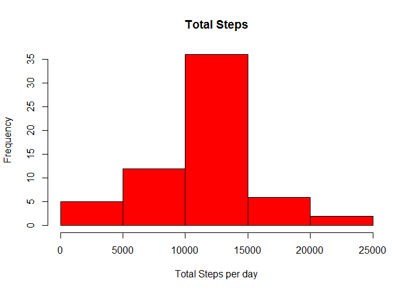
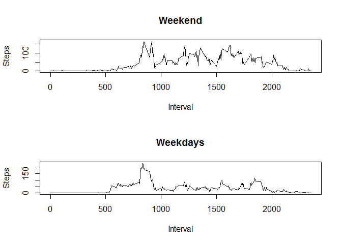

# Reproducible Research: Peer Assessment 1
António Howcroft Ferreira  
Saturday, February 14, 2015  

This is an R Markdown document. Markdown is a simple formatting syntax for authoring HTML, PDF, and MS Word documents. For more details on using R Markdown see <http://rmarkdown.rstudio.com>.

When you click the **Knit** button a document will be generated that includes both content as well as the output of any embedded R code chunks within the document. You can embed an R code chunk like this:


## Loading and preprocessing the data

<!--- 
setwd("C:/Users/ahf/Desktop/lectures_etc/coursera/jhopkins/represearch/assignment1/RepData_PeerAssessment1")
-->

```r
zipfile <- "repdata-data-activity.zip"
datafile <- "activity.csv"
unzip(zipfile, overwrite = TRUE, exdir = ".", unzip = "internal")
data <- read.csv(datafile)
#Data could be sanitized to only show meaningful means
dataNAsRemoved <- data[complete.cases(data),]
rm(zipfile)
```


## What is mean total number of steps taken per day?
1. Make a histogram of the total number of steps taken each day

```r
library(dplyr)
#Some days are present but have no data (e.g. 2012-10-01 for steps data)
# as.POSIXct Necessary for knittr limitation
dataNAsRemoved$date <- as.POSIXct(dataNAsRemoved$date)
answer <- summarise_each(group_by(dataNAsRemoved, date), funs(sum));
answer <- as.data.frame(answer);
hist(answer[,2], main="Total Steps", xlab = "Total Steps per day", col = "red")
```

 

2. Calculate and report the mean and median of the total number of steps taken per day


```r
meanStepsAllDays <- mean(answer[, 2])
medianStepsAllDays <- median(answer[, 2])
sprintf("The mean and median number of steps taken each day are %f and %d, respectively", meanStepsAllDays, medianStepsAllDays)
```

```
## [1] "The mean and median number of steps taken each day are 10766.188679 and 10765, respectively"
```

## What is the average daily activity pattern?

Make a time series plot (i.e. type = "l") of the 5-minute interval (x-axis) and the average number of steps taken, averaged across all days (y-axis)


```r
#plot interval (answer[,1]) column over number of steps (answer[,2]).
answer <- summarise_each(group_by(dataNAsRemoved[,c(1,3)], interval), funs(mean))
answer <- as.data.frame(answer)
plot(answer[,1], answer[,2], type = "l", main="Daily activity pattern", xlab="Interval", ylab="Steps Taken")
```

 

Which 5-minute interval, on average across all the days in the dataset, contains the maximum number of steps?


```r
answer[which.max(answer$steps),]
```

```
##     interval    steps
## 104      835 206.1698
```


## Imputing missing values
Note that there are a number of days/intervals where there are missing values (coded as NA). The presence of missing days may introduce bias into some calculations or summaries of the data.

Calculate and report the total number of missing values in the dataset (i.e. the total number of rows with NAs)

```r
#dim(data)[1] - sum(complete.cases(data)) # would be the answer but since we've already have the length of data with NAsRemoved lets use that instead
dim(data)[1] - dim(dataNAsRemoved)[1]
```

```
## [1] 2304
```


Devise a strategy for filling in all of the missing values in the dataset. The strategy does not need to be sophisticated. For example, you could use the mean/median for that day, or the mean for that 5-minute interval, etc.
Create a new dataset that is equal to the original dataset but with the missing data filled in.


```r
# Get mean steps and index them, based on interval averages, for subsitution in dataset
indexesForLookup <- match(data[is.na(data$steps), "interval"], answer$interval)
# Substitute NAs with mean for respective interval mean
data[is.na(data$steps), "steps"] <- answer[indexesForLookup, 2]
#any(is.na(data$steps))
```

Make a histogram of the total number of steps taken each day and Calculate and report the mean and median total number of steps taken per day. Do these values differ from the estimates from the first part of the assignment? What is the impact of imputing missing data on the estimates of the total daily number of steps?

Reply: Yes it does, it will skew the data in terms of frequency (went up from 15 to 25 on the y axis) compared to the first histogram. This is especially due to the fact that days that had no data (such as the 1st) now have the mean data. The distribution itself is not affected on horizontal (x) axis.


```r
answer <- summarise_each(group_by(data, date), funs(sum))
answer <- as.data.frame(answer)
hist(answer[,2], main="Total Steps", xlab = "Total Steps per day", col = "red")
```

 

## Are there differences in activity patterns between weekdays and weekends?
For this part the weekdays() function may be of some help here. Use the dataset with the filled-in missing values for this part.

Create a new factor variable in the dataset with two levels - "weekday" and "weekend" indicating whether a given date is a weekday or weekend day.

Make a panel plot containing a time series plot (i.e. type = "l") of the 5-minute interval (x-axis) and the average number of steps taken, averaged across all weekday days or weekend days (y-axis). See the README file in the GitHub repository to see an example of what this plot should look like using simulated data.


```r
weekendTestAbb <- c("Sat", "Sun")
data$weekend <- weekdays(as.POSIXct(data$date), abbreviate = TRUE) %in% weekendTestAbb
data$weekday <- !data$weekend
averages <- as.data.frame(summarise_each(group_by(data[data$weekend,], interval), funs(mean)))
averages2 <- as.data.frame(summarise_each(group_by(data[data$weekday,], interval), funs(mean)))
par(mfrow = c(2,1))
plot(averages$interval, averages$steps, type = "l", main="Weekend", xlab="Interval", ylab="Steps")
plot(averages2$interval, averages2$steps, type = "l", main="Weekdays", xlab="Interval", ylab="Steps")
```

 


<!---
Clean up Routines.
This is the only part where the assignment rule of echo=true is broken. Please forgive me ;)
-->


