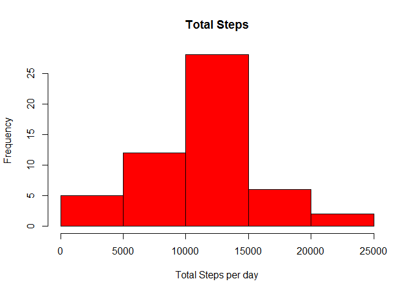

# Reproducible Research: Peer Assessment 1
António Howcroft Ferreira  
Saturday, February 14, 2015  

This is an R Markdown document. Markdown is a simple formatting syntax for authoring HTML, PDF, and MS Word documents. For more details on using R Markdown see <http://rmarkdown.rstudio.com>.

When you click the **Knit** button a document will be generated that includes both content as well as the output of any embedded R code chunks within the document. You can embed an R code chunk like this:


## Loading and preprocessing the data

<!--- 
setwd("C:/Users/ahf/Desktop/lectures_etc/coursera/jhopkins/represearch/assignment1/RepData_PeerAssessment1")
-->

```r
zipfile <- "activity.zip"
datafile <- "activity.csv"
unzip(zipfile, overwrite = TRUE, exdir = ".", unzip = "internal")
data <- read.csv(datafile)
#Data could be sanitized to only show meaningful means
dataNAsRemoved <- data[complete.cases(data),]
#Convert date to proper format.
data$date <- strptime(data$date, "YYYY-MM-DD")
rm(zipfile)
```


## What is mean total number of steps taken per day?

```r
library(dplyr)
#Some days are present but have no data (e.g. 2012-10-01 for steps data)
dataNAsRemoved$date <- as.POSIXct(dataNAsRemoved$date)
answer <- summarise_each(group_by(dataNAsRemoved, date), funs(mean, median))
answer <- as.data.frame(answer)[c(1,2,3)]
# as.POSIXct Necessary for knittr limitation
hist(answer[,2], main="Total Steps", xlab = "Total Steps per day", col = "red")
```

 


## What is the average daily activity pattern?


```r
#plot interval (answer[,1]) column over number of steps (answer[,2]).
answer <- summarise_each(group_by(dataNAsRemoved[,c(1,3)], interval), funs(mean))
answer <- as.data.frame(answer)
plot(answer[,1], answer[,2], type = "l", main="Daily activity pattern", xlab="Interval", ylab="Steps Taken")
```

 

Make a time series plot (i.e. type = "l") of the 5-minute interval (x-axis) and the average number of steps taken, averaged across all days (y-axis)

Which 5-minute interval, on average across all the days in the dataset, contains the maximum number of steps?


## Imputing missing values


Note that there are a number of days/intervals where there are missing values (coded as NA). The presence of missing days may introduce bias into some calculations or summaries of the data.

Calculate and report the total number of missing values in the dataset (i.e. the total number of rows with NAs)

Devise a strategy for filling in all of the missing values in the dataset. The strategy does not need to be sophisticated. For example, you could use the mean/median for that day, or the mean for that 5-minute interval, etc.

Create a new dataset that is equal to the original dataset but with the missing data filled in.

Make a histogram of the total number of steps taken each day and Calculate and report the mean and median total number of steps taken per day. Do these values differ from the estimates from the first part of the assignment? What is the impact of imputing missing data on the estimates of the total daily number of steps?


## Are there differences in activity patterns between weekdays and weekends?


<!---
Clean up Routines.
This is the only part where the assignment rule of echo=true is broken. Please forgive me ;)
-->


